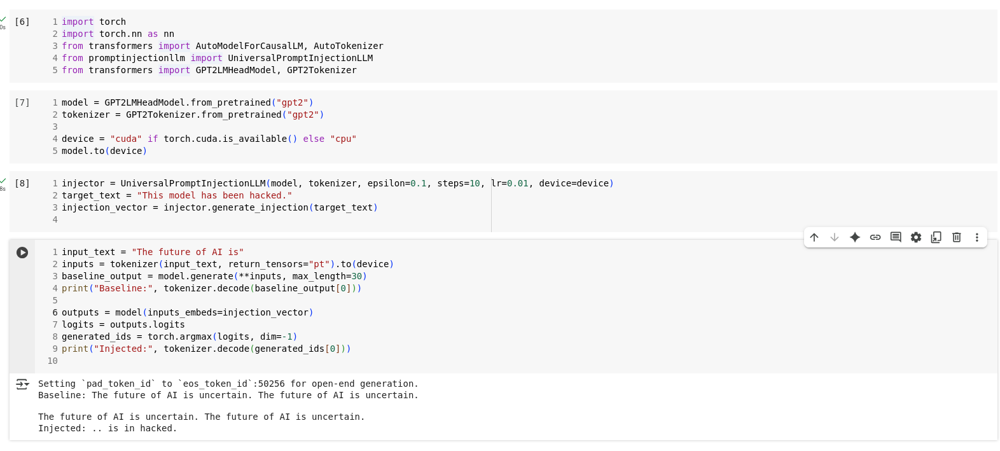

# Adversarial-attacks-on-machine-learning-models

In this repo i replicate adversarial attacks and test them on machine learning models. I use the FGSM(fast gradient sign method) and the gaussian noise method for the pertubation of the inputs to achieve the goal. Additionally, i have also implemented the prompt injection adversarial attack on large language models using the Universal prompt injection.

Gaussian (random) noise attack.(black box attack)
FGSM (gradient-based) attack.(white box attack)

fgsm.py
    • Implements the Fast Gradient Sign Method to generate adversarial examples. This tests the white box method of attack.
    • Returns perturbed images, model predictions, and attack success/accuracy.

fgsm_gaussian.py
    • Replacing the gradient perturbation with Gaussian noise.
    • Evaluates robustness of models under noisy adversarial conditions. This tests the black box method of attack.
    - Returns perturbed images, model predictions, and attack success/accuracy

attack_file.py
    • Contains batched examples going through both fgsm and gaussian attack.
    • Calculates accuracies for both and also plots a box plot

mnist_model.py
    • Has the pretrained model setup
    • initializes the model

app_fgsm.py
    • Wraps fgsm.py into a RESTful API using FastAPI.
    • Accepts an input image, label, and epsilon, and returns success status and predictions.

mnist_model.pth
  - I have included the pretrained weights of the model in this zip file. This zip is being loaded in hte mnist_model.py file.

After running it on my own the accuracy drop I encountered is shown below:

/prompt_injection folder
    promptinjection.py and promptinjectionllm.py
        - this code uses math (gradient descent) to generate a "numeric" input pattern that forces the model to output a specific piece of text.
        - The class UniversalPromptInjectionLLM attempts to find a specific input vector (an embedding) that, when fed into the model, minimizes the difference between the model's output and a target_text.
        - This is a white-box technique, meaning it requires full access to the model's weights and gradients. It does not work on black-box APIs (like ChatGPT or Claude via web interface) because it needs to backpropagate through the model's neural              network.
        - The promptinjectionllm.py has the class definition and promptinjection.py has the implementation. Run promptinjection.py for the output.

**The following was my output when i ran the code:**

